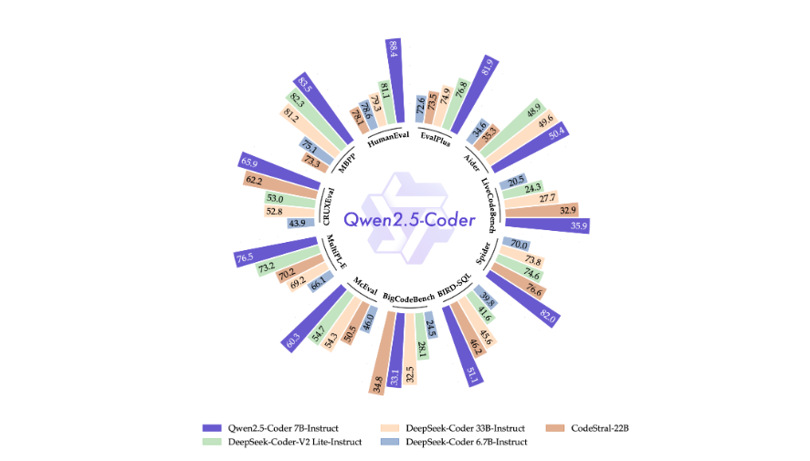

# Fossee-python-task

## Research Plan
During my research, I explored about various open source models and LLMs such as StarCoder, WizardCoder, Codestral recently released models like Qwen2.5-Coder, CodeLlama, DeepSeek Coder v2, DeepSeek-V3, and Qwen3-Coder.Each model has it’s advantages, CodeLlama has python-focused variant and large user base as it’s strength,DeepSeek Coder v2 gives a strong balance of scalability and efficiency, DeepSeek V3 despite being a powerful general-purpose foundation model, it is not exclusive for coding tasks and Qwen3 has advanced features like longer context windows and larger scaling options, but it’s ecosystem is still young.Despite these strengths, I chose Qwen2.5-Coder, particularly its instruction-tuned variants (0.5B–32B), as the most suitable for Python competence analysis. On benchmarks such as HumanEval and MBPP, it not only demonstrated strong accuracy in reasoning but also proved to be adaptable, scalable across hardware, and interoperable with existing educational workflows—making it the most balanced option for immediate deployment.

A model is considered appropriate for high-level competence analysis if it not only solves coding problems but analyzes the student's code, surfaces misconceptions, and proposes prompts that encourage further reasoning without giving away the final solution.I specifically used the instruction-tuned version of Qwen2.5-Coder instead of using the base model since it's trained to comply with educational instructions, produce reasoning-related responses, and point out missing concepts which the base model lacks.To evaluate and validate this, I developed a prototype Planner-Executor-Critic (PEC). The Planner finds concepts, Bloom-level, and possible gaps; the Executor produces Socratic-like probational questions; and the Critic tests those questions for relevance, depth, and clarity.Running this pipeline confirmed that Qwen2.5’s instruction tuning and maturity allow it to produce feedback that is accurate, interpretable, and pedagogically meaningful.For future research, this work can be extended by conducting cross-model comparisons with Qwen3-Coder and DeepSeek Coder v2 to explore trade-offs, by fine-tuning Qwen2.5-Instruct on student-specific datasets to enhance prompt generation quality, and by evolving the PEC framework into an adaptive multi-round system (PEC 2.0) that dynamically adjusts prompts as misconceptions are uncovered. Despite newer models like Qwen3 pushing raw accuracy higher and DeepSeek-V3 excelling at general-purpose reasoning, their higher resource demands and less established ecosystems make them less practical for this use case and Qwen3 is still in earlier stages of development, with its tools and community support continuing to grow. In contrast, Qwen2.5 Coder offers proven reliability, better integration resources, and extensive real-world testing which reinforces that it’s a more reliable choice for this specific usecase. In conclusion, after an extensive technical analysis, benchmark comparisons on the model, and validating its practicality through my prototype, these factors reassured me to confidently state that Qwen2.5-Coder is the most optimal and well-suited model for our use case.

## Benchmarks

## Prototype
## References
